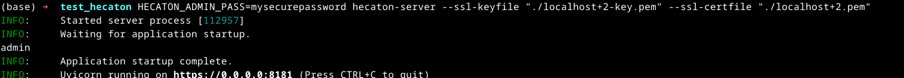

# Hecaton

Hecaton is a solution for self-hosted GPU access from a source that isn't deployed. It allows you to distribute compute jobs across multiple workers (GPUs).


## Installation

Hecaton can be installed as a Python package.

```bash
pip install hecaton
```

> **Note**: For GPU workers, you must run the installation and the worker process as **root** because it uses `docker` python client which requires root access to interact with the Docker daemon.

## Quick Start

### 1. Server Setup

Start the server. On the first run, you should provide an admin password via environment variable to create the initial admin user.

```bash
# Create initial admin user (runs on port 8181 by default)
HECATON_ADMIN_PASS=mysecurepassword hecaton-server --port 8181
```

Once the admin is created, you can simply run:
```bash
hecaton-server --port 8181
```

**SSL/TLS (Recommended)**:
```bash
hecaton-server --port 8181 --ssl-keyfile key.pem --ssl-certfile cert.pem
```



### 2. Client Setup

Configure the client to point to your server using the CLI:

```bash
# Register the server locally
hecaton server new --ip <server_ip>:8181 --name my-server

# Log in (get the token)
hecaton server login my-server --username admin --password mysecurepassword
```


### 3. Worker Setup

To add a GPU worker to the cluster:

**Requirements**:
- Docker must be installed and running.
- Must run as **root**.

```bash
sudo pip install hecaton
```

```bash
# Connect the worker (as root)
sudo hecaton-gpu install <server_ip>:8181

# You will be prompted for a username and password (e.g., admin credentials or a dedicated worker user)
```

The worker will automatically register with the server and start processing jobs.

### 4. Job Submission

Submit a job with a payload file and a target image:

```bash
hecaton job new <path_to_payload_file> <docker_image_name>
```

### 5. Programmatic Job Submission

You can also submit and monitor jobs using the Python client library:

```python
import time
from hecaton.client.managers.api import HecatonServer

server_ip = "http://localhost:8181"
token = "YOUR_JWT_TOKEN"

# Submit the job (payload.json is read and sent to the worker)
job_id = HecatonServer.new_job(
    ip=server_ip, secret=token, 
    file_path="payload.json", image="my-custom-image:latest"
)
print(f"Submitted Job ID: {job_id}")

# Poll for completion
while True:
    job_info = HecatonServer.get_job(server_ip, token, job_id)
    if job_info[1] in ("FINISHED", "FAILED"):
        print("Result:", job_info[2])
        break
    time.sleep(2)
```

### 6. Writing a Payload and Custom Docker Image

Hecaton uses a long-running container model to process jobs. When you submit a job to a specific Docker image, Hecaton ensures a container of that image is running and passes the job payload to it.

To easily write the python code for your custom Docker image, you should use Hecaton's built-in `serverless` module.

**Example `handler.py` (Entrypoint for your Docker image):**
```python
from hecaton.serverless import start, ServerLessInput

def my_handler(data: ServerLessInput):
    # 'data.input' contains the payload you submitted via the CLI or API (e.g., payload.json)
    job_payload = data.input
    
    print(f"Processing job with data: {job_payload}")
    
    # Perform your GPU compute or other tasks here
    result = {"status": "success", "processed_data": job_payload}
    
    # Return the result dict, it will be uploaded back to the server
    return result

if __name__ == "__main__":
    # 'start()' keeps the container running and polls the worker for jobs
    start(my_handler)
```

**Dockerfile Example:**
```dockerfile
FROM python:3.9-slim
RUN pip install hecaton
COPY handler.py /app/handler.py
CMD ["python", "/app/handler.py"]
```
Once this image is built, pushed, and registered on the Hecaton server, you can submit payloads to it.

## Command Reference

### Client CLI (`hecaton`)

The `hecaton` command is your main interface for interacting with the server.

#### Server Management (`hecaton server`)
Manage your local server connections.

- **`new`**: Register a new server.
  - `--ip`: Server IP/URL (e.g., `localhost:8181`).
  - `--name`: Local alias for the server.
- **`login`**: Authenticate with a server.
  - `server_name`: The alias of the server.
  - `--username`, `--password`: Credentials.
- **`list`**: List registered servers.
- **`connect`**: Switch the active server context.
- **`disconnect`**: Unset the active server.
- **`show`**: View details of a server.
- **`update`**: Update server configuration (e.g., IP).

#### User Management (`hecaton user`)
Manage users (Requires Admin privileges).

- **`create`**: Create a new user.
  - `--username`: New user's name.
  - `--password`: New user's password.
  - `--role`: Role (default: `user`).

#### Worker Management (`hecaton worker`)
Monitor connected workers.

- **`list`**: List all workers, their status, and last active time.

#### Image Management (`hecaton image`)
Manage Docker images available for jobs.

- **`new`**: Register a new Docker image from Docker Hub.
  - `image_name`: e.g., `python:3.9-slim`.
- **`list`**: List registered images.
- **`update`**: Update image metadata.
  - `--fp`: Path to a file containing environment variables (`KEY=VALUE` per line).
  - `--desc`: Update description.
- **`show`**: Show image details including environment variables.

#### Job Management (`hecaton job`)
Submit and track jobs.

- **`new`**: Submit a new job.
  - `file_path`: Path to the script/payload to run.
  - `image_name`: The Docker image to use.
- **`list`**: List recent jobs and their statuses.
- **`show`**: View full details of a specific job (ID, status, payload, index).

### GPU Worker CLI (`hecaton-gpu`)

The `hecaton-gpu` command runs on the worker machine to manage the background service. **Must be run as root.**

- **`install <server_ip>`**: Install the worker as a systemd service.
  - prompts for username/password authentication.
- **`uninstall`**: Remove the systemd service.
- **`start`**: Start the worker service.
- **`stop`**: Stop the worker service.
- **`restart`**: Restart the worker service.
- **`status`**: Check if the service is running.
- **`logs`**: View service logs.
  - `-f`: Follow logs.
  - `-n`: Number of lines.
- **`run <server_ip>`**: Run the worker in the foreground (useful for debugging).
